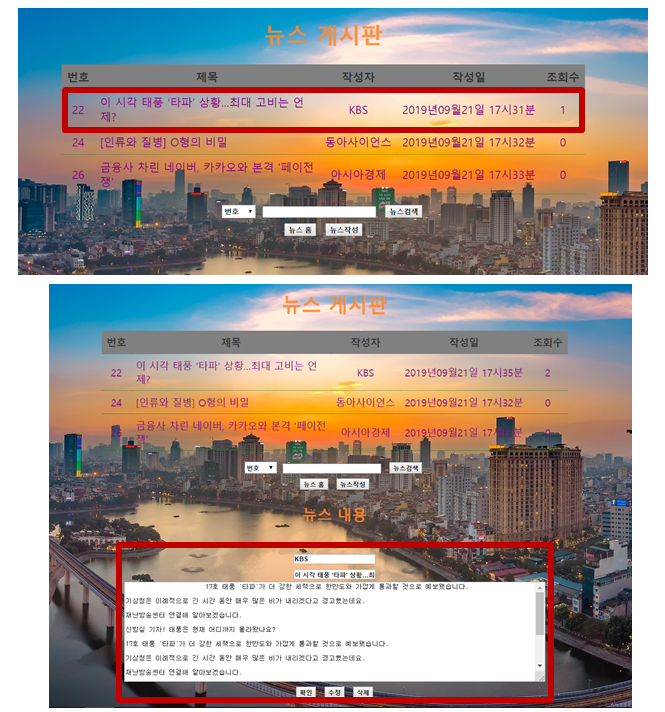

# Spring MVC - Based Board

## Index

- Spring MVC 패턴 기법을 적용한 게시판 만들기 실습 프로젝트

## Architecture

- Client

  - HTML5 / CSS3 / JavaScript / jquery
  - JSP
  
- Server

  - Spring MVC FrameWork
  - Tomcat 9
  
- Database

  - Oracle 11g XE
  
- Development Flatform

  - jdk1.8.0_211
  - eclipse-jee-2018-12-R-win32-x86_64
  - Spring STS 3.9.9
  - sqldeveloper
  - Chrome

## Install Method

- Project [Clone]
- Eclipse [Import] - [Project from Folder or Archive]
- Select [Project Folder]
- [Wait] for Completion and Installation

## Screen Configuration

- 메인 페이지 & 게시글 출력

  

  ---

- 게시글 업로드 & 수정

  

  ---

- 게시글 삭제

  